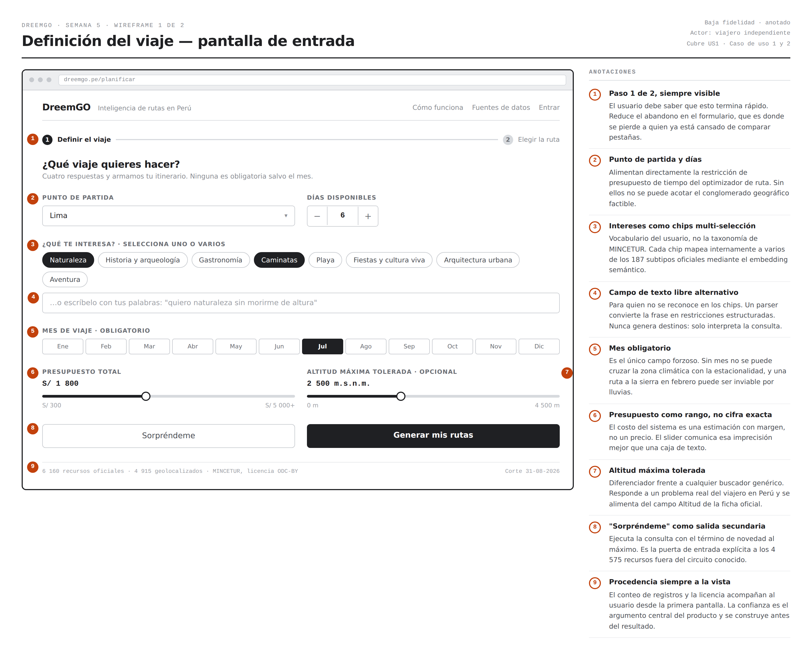
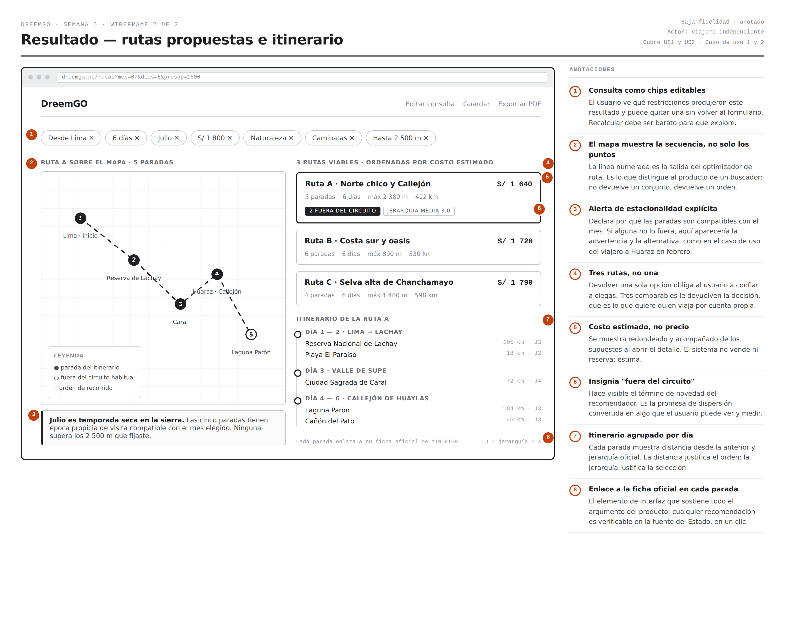
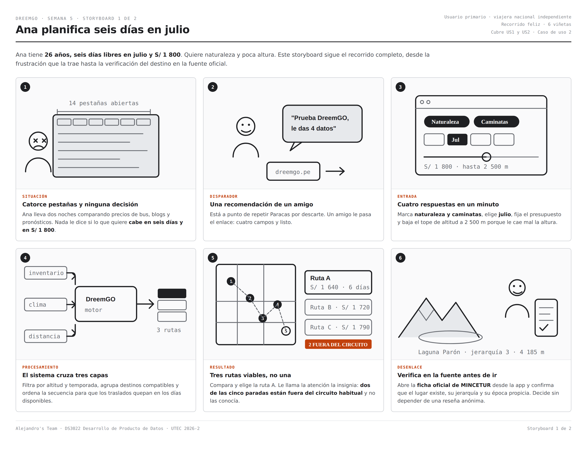
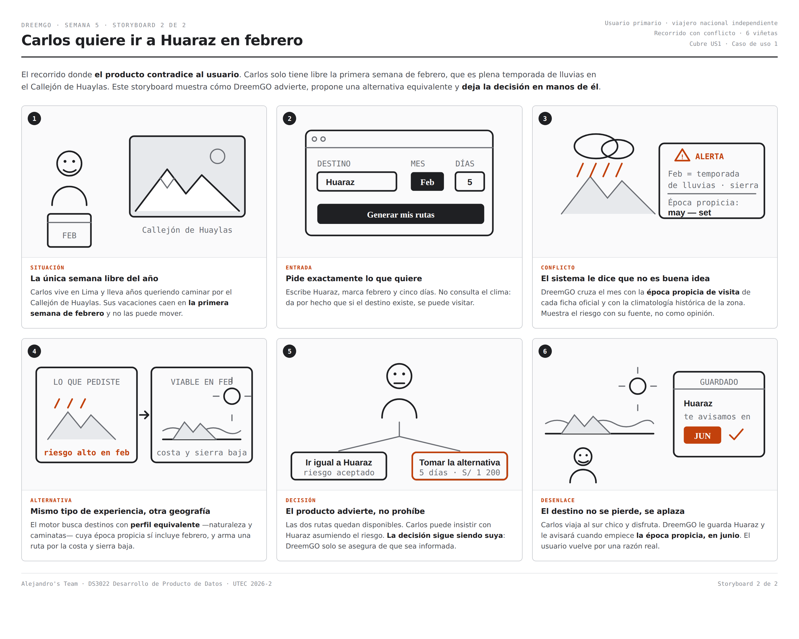
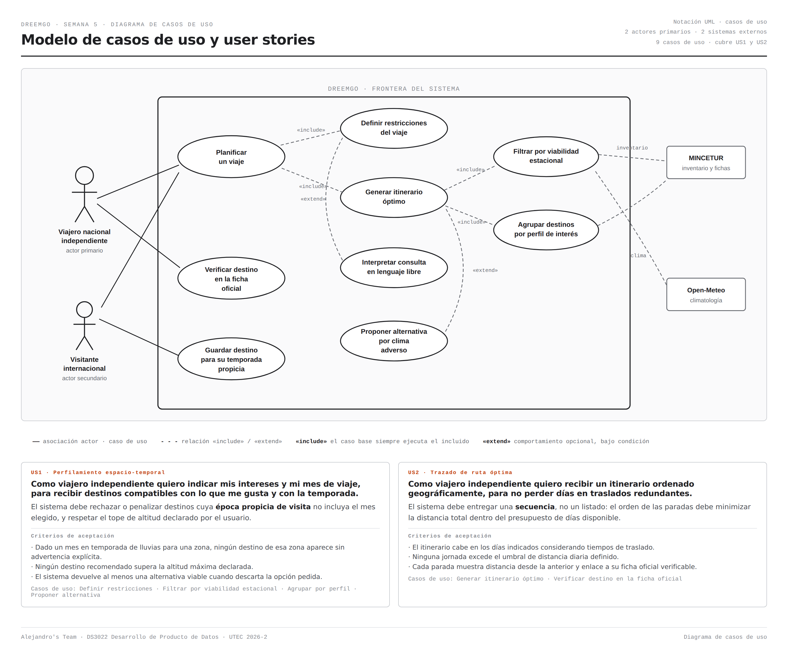

# Requirements & Product Design — Semana 5

**Producto:** DreemGO — Inteligencia de rutas en Perú
**Equipo:** Miguel · Alejandro · Diego · Christopher
**Curso:** DS3022 Desarrollo de Producto de Datos · UTEC · Prof. Germain Garcia-Zanabria

---

## 0. Stakeholders, supuestos y restricciones

### Stakeholders

| Stakeholder | Interés en el producto | Tipo |
|---|---|---|
| Viajero nacional independiente | Decidir un itinerario viable sin dedicarle días a comparar fuentes | Usuario primario |
| Visitante internacional de estadía media | Encadenar destinos coherentes en los días que tiene en el país | Usuario secundario |
| Gobiernos regionales y oficinas de destino | Dispersar la demanda hacia recursos infrautilizados de su territorio | Cliente potencial |
| MINCETUR | Que su inventario público se use y se retroalimente | Proveedor de datos |
| Operadores y hospedajes locales | Aparecer en itinerarios fuera del circuito saturado | Beneficiario indirecto |
| Equipo docente DS3022 | Evaluar el producto de datos y su reproducibilidad | Evaluador |

### Supuestos

1. El Inventario Nacional de Recursos Turísticos está vigente a su fecha de corte y sus fichas son accesibles públicamente.
2. El usuario conoce su presupuesto aproximado y sus días disponibles antes de usar el producto.
3. La época propicia de visita declarada en la ficha oficial es una guía razonable de estacionalidad.
4. Los traslados se realizan por vía terrestre salvo indicación contraria.

### Restricciones

1. **No hay datos de precio por recurso.** El costo mostrado es una estimación derivada, no una tarifa.
2. **No hay red vial en la fase 1.** Las distancias son geodésicas; la geometría real de OpenStreetMap entra en la Semana 10.
3. **Solo fuentes con licencia redistribuible.** TripAdvisor y Google Places quedan fuera del repositorio por sus términos de servicio.
4. **El 20.2 % del inventario no tiene coordenadas** y no puede entrar al cálculo de rutas; se usa como capa de contexto por distrito.
5. Alcance geográfico limitado al territorio peruano en esta fase.

---

## 1. Producto y requerimientos

### RF-01 · Motor de recomendación espacio-temporal
El sistema debe procesar las restricciones del usuario —intereses, presupuesto, días disponibles, mes de viaje y altitud máxima tolerada— y devolver un conjunto de destinos compatibles. Debe cruzar la zona climática del destino con el mes elegido para **penalizar o descartar** recursos cuya época propicia de visita no incluya esa temporada, antes de construir cualquier itinerario.

**Criterio de aceptación:** dada una consulta en un mes de temporada de lluvias para una zona determinada, ningún recurso de esa zona aparece en el resultado sin una advertencia explícita y al menos una alternativa viable.

### RF-02 · Generación de itinerario ordenado
El sistema debe devolver una **secuencia**, no un listado: el orden de las paradas debe minimizar la distancia total recorrida respetando el número de días disponibles y un umbral máximo de traslado diario.

**Criterio de aceptación:** todo itinerario generado cabe en los días indicados considerando tiempos de traslado estimados, y ninguna jornada supera el umbral definido.

### RNF-01 · Integridad y trazabilidad analítica
El pipeline debe mantener desacopladas las variables estáticas del inventario (coordenadas, altitud, zona climática base) de las reglas dinámicas de tiempo (mes de viaje), de modo que el dataset núcleo no se altere estructuralmente al cambiar la temporada consultada. Todo recurso recomendado debe conservar el enlace a su ficha oficial.

**Criterio de aceptación:** el 100 % de los recursos recomendados enlaza a una ficha oficial verificable, y recalcular con otro mes no modifica el dataset base.

### RNF-02 · Latencia
El sistema debe devolver las rutas propuestas en menos de 5 segundos para una consulta sobre una macrorregión.

---

## 2. Casos de uso

### CU-01 · Viaje en temporada adversa

| | |
|---|---|
| **Actor principal** | Viajero nacional independiente |
| **Precondiciones** | El inventario enriquecido está cargado y el usuario definió mes y presupuesto |
| **Postcondiciones** | El usuario recibe al menos una ruta viable y la advertencia documentada de la opción descartada |

**Flujo principal**

1. El usuario selecciona intereses "aventura" y "caminatas", presupuesto bajo y mes de viaje febrero.
2. El sistema identifica polos andinos compatibles con los intereses.
3. El sistema cruza la zona climática de esos polos con febrero y detecta temporada de lluvias.
4. El sistema penaliza esos destinos y muestra la advertencia con su fuente.
5. El sistema propone un conglomerado equivalente en costa y sierra baja.
6. El usuario elige entre la alternativa propuesta y la opción original.

**Flujo alternativo 6a — el usuario insiste con el destino original**
El sistema genera igualmente la ruta pedida, marcando cada parada con su nivel de riesgo estacional. La decisión no se bloquea.

**Flujo alternativo 5a — no existe alternativa equivalente**
El sistema informa que no hay conglomerado compatible con esos intereses en ese mes y sugiere los dos meses más próximos en que sí lo habría.

**Excepción — sin conectividad con la fuente climática**
El sistema opera con la época propicia declarada en la ficha oficial y advierte que la validación climática está degradada.

### CU-02 · Viaje en temporada favorable

| | |
|---|---|
| **Actor principal** | Viajero nacional independiente |
| **Precondiciones** | El usuario definió intereses, mes, días y presupuesto |
| **Postcondiciones** | El usuario obtiene un itinerario ordenado con costo estimado y enlaces verificables |

**Flujo principal**

1. El usuario selecciona "naturaleza" y "caminatas", presupuesto medio, julio, seis días, altitud máxima 2 500 m.
2. El sistema filtra los recursos que superan el tope de altitud.
3. El sistema valida que la época propicia de los candidatos incluya julio.
4. El sistema agrupa los destinos compatibles en conglomerados geográficamente factibles.
5. El sistema ordena las paradas del conglomerado ganador minimizando la distancia total.
6. El sistema devuelve tres rutas alternativas ordenadas por costo estimado.
7. El usuario elige una y consulta la ficha oficial de una parada antes de decidir.

**Flujo alternativo 6a — el presupuesto no alcanza para ninguna ruta**
El sistema muestra la ruta más económica posible e indica cuánto excede el presupuesto declarado.

---

## 3. Wireframes

Ambos wireframes son de baja fidelidad y están anotados: cada elemento numerado explica la decisión de diseño que hay detrás y a qué requerimiento responde.

### Wireframe 1 — Definición del viaje



Pantalla de entrada. Recoge las cinco restricciones que alimentan el motor: punto de partida, días, intereses, mes de viaje y presupuesto, más el tope de altitud opcional. Cubre RF-01, US1, CU-01 y CU-02.

### Wireframe 2 — Resultado e itinerario



Pantalla de resultado. Mapa con la secuencia numerada a la izquierda, tres rutas comparables y el itinerario por día a la derecha, con alerta de estacionalidad y enlace a la ficha oficial en cada parada. Cubre RF-02, RNF-01, US1 y US2.

---

## 4. Storyboards

### Storyboard 1 — Ana planifica seis días en julio



Recorrido completo del usuario primario en el camino feliz: desde la frustración de comparar catorce pestañas hasta la verificación del destino en la fuente oficial. Seis viñetas, correspondiente a CU-02.

### Storyboard 2 — Carlos quiere ir a Huaraz en febrero



El recorrido donde el producto contradice al usuario: advierte el riesgo estacional con su fuente, propone una alternativa equivalente y deja la decisión en manos de la persona. Seis viñetas, correspondiente a CU-01.

---

## 5. User stories y diagrama



Modelo UML de casos de uso con dos actores primarios, dos sistemas externos y nueve casos de uso, con las relaciones «include» y «extend» que conectan el caso base con sus dependencias.

### US1 · Perfilamiento espacio-temporal

> **Como** viajero independiente **quiero** indicar mis intereses y mi mes de viaje **para** recibir destinos compatibles con lo que me gusta y con la temporada.

**Criterios de aceptación**
- Dado un mes en temporada de lluvias para una zona, ningún destino de esa zona aparece sin advertencia explícita.
- Ningún destino recomendado supera la altitud máxima declarada por el usuario.
- El sistema devuelve al menos una alternativa viable cuando descarta la opción pedida.

**Casos de uso que la realizan:** Definir restricciones del viaje · Filtrar por viabilidad estacional · Agrupar destinos por perfil de interés · Proponer alternativa por clima adverso

### US2 · Trazado de ruta óptima

> **Como** viajero independiente **quiero** recibir un itinerario ordenado geográficamente **para** no perder días en traslados redundantes.

**Criterios de aceptación**
- El itinerario cabe en los días indicados considerando tiempos de traslado.
- Ninguna jornada excede el umbral de distancia diaria definido.
- Cada parada muestra la distancia desde la anterior y el enlace a su ficha oficial verificable.

**Casos de uso que la realizan:** Generar itinerario óptimo · Verificar destino en la ficha oficial

---

## 6. Tareas analíticas

### TA-01 · Agrupamiento espacio-temporal de destinos
Aplicar clustering no supervisado (K-Means o HDBSCAN) sobre el dataset enriquecido usando latitud, longitud, altitud e índice de lejanía logística. Post-procesar los conglomerados cruzando la `ZONA_CLIMATICA` con el mes de viaje para ponderar cuál es el conglomerado ganador de la recomendación.

- **Entradas:** coordenadas corregidas, altitud, zona climática, índice de lejanía, mes de viaje.
- **Salida:** conglomerado recomendado y puntaje por destino.
- **Baseline:** partición por departamento y por taxonomía MINCETUR.
- **Métricas:** coeficiente de silueta y Davies-Bouldin frente al baseline; interpretabilidad cualitativa de los conglomerados.

### TA-02 · Ingeniería de variables geoespaciales y climáticas
Resolver la ausencia de altitud, costo y clima en el CSV de datos abiertos mediante enriquecimiento externo y derivación determinista.

- **Altitud:** obtenida del modelo de elevación de Open-Meteo. Contrastada contra la altitud oficial de las fichas: desviación de +16 a −38 m en meseta y valle, y hasta +250 m en cañón, donde el modelo suaviza el relieve. Se documenta como limitación conocida.
- **`DISTANCIA_CAPITAL_KM`:** distancia Haversine del recurso a su capital regional.
- **`INDICE_LEJANIA`:** categorización ordinal de la distancia anterior (1 = menos de 20 km; 2 = menos de 80 km; 3 = más de 80 km). *Se renombró desde `INDICE_COSTO_LOGISTICO` porque la variable no contiene unidades monetarias: es una aproximación de lejanía, no un costo. El costo real requiere red vial y tipo de ingreso, previstos para la Semana 10.*
- **`ZONA_CLIMATICA`:** inferida por pisos ecológicos peruanos a partir de altitud y región.

### TA-03 · Extracción de las fichas oficiales *(Semana 6)*
Recuperar de las 6 160 fichas públicas de MINCETUR los campos que el CSV de datos abiertos no publica y que el producto necesita: **jerarquía (1-4)** como señal oficial de importancia, **época propicia de visita** como estacionalidad por recurso, **tipo de ingreso** como aproximación de costo, **altitud oficial** y **actividades desarrolladas** para el perfilamiento semántico.

- **Justificación:** cada uno de estos campos responde directamente a una promesa del producto que hoy no tiene fuente.
- **Consideraciones:** una petición por segundo, identificación del agente, caché local de resultados y verificación previa del `robots.txt`.

---

## 7. Estructura de la entrega

```
week05/
├── Requirements.md            este documento
├── DataProductCanvas.md
├── DataProductCanvas.pdf
├── assets/
│   ├── wireframe_01.png
│   ├── wireframe_02.png
│   ├── storyboard_01.png
│   ├── storyboard_02.png
│   └── diagrama_casos_uso.png
├── code/
│   ├── enrich_data.py
│   ├── add_climate.py
│   ├── fix_altitudes.py
│   ├── fix_pricing.py
│   ├── build_features.py
│   └── verify_enriched.py
└── data/
    ├── dataset_enriched.csv
    └── data_dictionary_v2.csv
```
