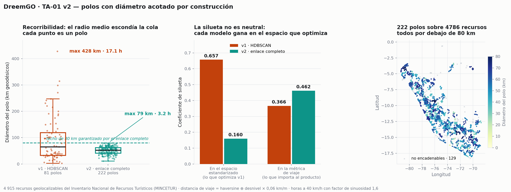

# DreemGO — Selección de Modelo

**Semana 6** · DS3022 Desarrollo de Producto de Datos · UTEC · Prof. Germain Garcia-Zanabria
Equipo: Miguel · Alejandro · Diego · Christopher
Entrega: 16 de septiembre de 2026

---

## 1. Qué problema resuelve el componente analítico

DreemGO no responde "¿qué hay cerca?". Responde **"¿qué conjunto de destinos puedo recorrer en los días que tengo, en el mes en que viajo, según lo que me interesa?"**. Eso se descompone en cinco tareas, y solo la primera es un problema de aprendizaje.

| Tarea | Tipo | Estado en esta entrega |
|---|---|---|
| **TA-01** Agrupamiento espacio-temporal de destinos | Aprendizaje no supervisado | **Implementada, auditada y rehecha (v2)** |
| **TA-02** Ingeniería de variables geoespaciales | Derivación determinista | Implementada (Semana 5) |
| **TA-03** Extracción de fichas oficiales | Extracción | **Completa** — 6 129 fichas · ver `DataAnalysis.md` §3.1 |
| **TA-04** Ordenamiento de la ruta | Optimización combinatoria | **Implementada y evaluada** — §8 |
| **TA-05** Viabilidad estacional del polo | Regla sobre datos climáticos | **Implementada** — §9 |

Este documento cubre **TA-01**, **TA-04** y **TA-05**.

> **Nota de numeración.** TA-01 a TA-03 vienen de `week05/Requirements.md` §6. TA-04
> estaba ahí descrita sin número y TA-05 no existía: la viabilidad estacional aparecía
> como post-proceso dentro de TA-01. Se numeran aquí porque ya son componentes con
> código, salida y evaluación propios. `Requirements.md` se alinea en la Delivery 1.

### 1.1 Por qué no supervisado

El producto arranca **sin etiquetas y sin interacciones de usuario**: no hay clics, ni valoraciones, ni itinerarios históricos que aprender. Es un arranque en frío estricto. Eso descarta de entrada el filtrado colaborativo y cualquier modelo supervisado de relevancia, y deja el agrupamiento por estructura como la vía disponible.

No es una limitación que se compense con un modelo más grande: es una ausencia de datos. La capa supervisada (learning-to-rank sobre itinerarios aceptados) queda condicionada a que el prototipo de la Semana 10 genere uso real.

### 1.2 Qué debe cumplir un buen conglomerado

Un agrupamiento es útil para este producto si cumple dos cosas a la vez:

1. **Cohesión estadística** — los recursos de un grupo se parecen entre sí en el espacio de características.
2. **Recorribilidad** — un viajero puede visitar varios recursos del grupo en un mismo viaje.

La segunda no la miden ni la silueta ni Davies-Bouldin, y resultó ser la que decide: el modelo que gana en cohesión produce polos de hasta doce horas de punta a punta (§5.7). La medimos con el **diámetro** del polo, y el modelo final la garantiza por construcción en lugar de reportarla después.

---

## 2. Datos de entrada

**4 915 recursos geolocalizables** del Inventario Nacional de Recursos Turísticos (MINCETUR), de un total de 6 160. Los 1 245 excluidos son las prácticas y eventos sin coordenada documentados en `DataAnalysis.md` §2.2.

| Variable | Tipo | Papel |
|---|---|---|
| `latitud`, `longitud` | Continua | Estructura geográfica — define qué es encadenable |
| `ALTITUD` | Continua (0–6 692 m) | Separa pisos ecológicos y condiciona el esfuerzo del viaje |
| `INDICE_COSTO_LOGISTICO` | Ordinal 1–3 | Accesibilidad respecto de la capital regional |

Para los candidatos 1 y 2 se estandarizan con `StandardScaler`, de modo que la altitud (rango de miles) no quede aplastada por la latitud (rango de decenas). El candidato 3 no usa ese espacio: opera sobre una matriz de distancias de viaje en kilómetros (§3).

**Variables deliberadamente excluidas del vector de agrupamiento:**

- `TIPO_INGRESO` y `EPOCA_PROPICIA`, por ser funciones deterministas de otras columnas (`DataAnalysis.md` §3.1). Incluirlas sería introducir la misma información dos veces.
- `JERARQUIA_OFICIAL`, que **sí es un dato real y verificado**, pero mide importancia y no ubicación. Meterla en el espacio de agrupamiento produciría polos de «cosas importantes repartidas por 400 km», que es justo lo que el producto no puede recomendar. Entra en el sistema como capa de ordenamiento sobre polos ya formados (§6.5).

**Salida:** una etiqueta de polo por recurso, más los recursos que no alcanzan el tamaño mínimo de polo.

---

## 3. Modelos evaluados

### Baseline 1 · Partición por REGIÓN
La división política del Perú, 25 grupos. Es el baseline correcto porque es **lo que hace hoy cualquier buscador turístico**: te muestra los atractivos del departamento. Si el modelo no le gana, el modelo no aporta.

### Baseline 2 · Partición por REGIÓN × CATEGORÍA
La taxonomía oficial de MINCETUR cruzada con la región, 114 grupos. Baseline más exigente: usa la clasificación que la propia fuente considera relevante.

### Candidato 1 · K-Means
Particional, número de grupos fijado de antemano, grupos convexos y de tamaño comparable. Ventaja: interpretable y determinista. Desventaja: obliga a asignar cada recurso a algún grupo, aunque esté aislado en medio del desierto.

Barrido de k de 4 a 30.

### Candidato 2 · HDBSCAN
Jerárquico basado en densidad. No exige fijar el número de grupos, admite grupos de forma y tamaño arbitrarios, y —lo decisivo para este producto— **puede declarar un recurso como ruido en vez de forzarlo a un grupo**.

Barrido de `min_cluster_size` en {15, 25, 40, 60, 90}.

### Candidato 3 · Enlace completo sobre distancia de viaje

Agrupamiento jerárquico aglomerativo con **enlace completo**, sobre una distancia que no es la euclídea del espacio de características sino el esfuerzo de viaje entre dos recursos:

```
d_viaje(i, j) = √( haversine(i, j)²  +  (|altitud_i − altitud_j| · k)² )       k = 0,06 km/m
```

Con k = 0,06, mil metros de desnivel pesan como sesenta kilómetros de llano. El valor sale de un barrido conjunto de (umbral, k) buscando que ningún polo supere ~1 300 m de rango altitudinal, porque el usuario declara una altitud máxima tolerada y un polo que va de 200 a 4 000 m le sirve a medias.

La propiedad que lo hace candidato: **el enlace completo acota el diámetro del conglomerado por construcción.** Si el umbral es D, ningún par de recursos del mismo polo supera D. No es una métrica que se reporta después del ajuste; es una garantía del algoritmo.

Barrido del umbral en {60, 80, 100, 120} km de viaje efectivo.

---

## 4. Métricas

| Métrica | Qué mide | Dirección |
|---|---|---|
| **Coeficiente de silueta** | Cohesión interna frente a separación entre grupos | Mayor es mejor (−1 a 1) |
| **Índice Davies-Bouldin** | Razón entre dispersión interna y separación | **Menor** es mejor |
| **Calinski-Harabasz** | Razón de varianza entre e intra grupos | Mayor es mejor |
| **Radio medio (km)** | Distancia Haversine media de cada recurso al centroide geográfico de su grupo | **Menor** es mejor |
| **Diámetro (km)** | Distancia Haversine entre los dos recursos más separados del grupo | **Menor** es mejor |

Las dos últimas son **métricas de producto**: traducen el resultado a la pregunta que importa, que es si un viajero puede recorrer el polo.

**El radio no basta, y esa fue una equivocación de una versión anterior de este documento.** El radio mide la dispersión alrededor del centro; el diámetro mide el tamaño del polo. Un conglomerado con muchos recursos apiñados cerca del centroide y unos pocos lejos puede tener radio pequeño y diámetro enorme — que es exactamente lo que pasaba (§5.7). Para un itinerario, lo que limita es el diámetro: la parada más lejana de la otra punta.

Para leer el diámetro en términos de viaje usamos una conversión declarada: **40 km/h de velocidad media en carretera andina con factor de sinuosidad 1,6**, es decir unos 25 km geodésicos por hora de viaje real.

---

## 5. Resultados

### 5.1 Primera comparativa, y por qué no vale tal cual

| Modelo | Grupos | Aislados | Silueta ↑ | Davies-Bouldin ↓ | Radio medio ↓ |
|---|---:|---:|---:|---:|---:|
| Baseline · REGIÓN | 25 | 0 | −0,0446 | 3,2627 | 72,8 km |
| Baseline · REGIÓN × CATEGORÍA | 114 | 0 | −0,3734 | 6,7304 | 69,3 km |
| K-Means k=29 | 29 | 0 | 0,4736 | 0,7732 | 115,5 km |
| HDBSCAN mcs=15 | 81 | 1 155 | 0,6573 | 0,4186 | 30,2 km |

Esta tabla favorece a HDBSCAN por dos motivos que no tienen que ver con el modelo:

1. **Distinto número de grupos.** HDBSCAN forma 81 y el K-Means elegido, 29. Tanto la silueta como el radio mejoran casi siempre al aumentar el número de grupos, así que la fila de HDBSCAN parte con ventaja.
2. **Distinto número de puntos evaluados.** La silueta de HDBSCAN se calcula solo sobre los 3 760 recursos que agrupó, descartando los 1 155 que marcó como aislados — que son justamente los más difíciles. K-Means y los baselines se evalúan sobre los 4 915.

La §5.2 corrige ambas cosas. Dejamos esta tabla porque es la que produce la ejecución directa del barrido, y porque explicar por qué no basta es parte del criterio de selección.

### 5.2 Comparación controlada

**Mismo subconjunto de puntos (los 3 760 que HDBSCAN agrupa) y número de grupos comparable:**

| Modelo | Grupos | Silueta ↑ | Davies-Bouldin ↓ | Radio medio ↓ |
|---|---:|---:|---:|---:|
| **HDBSCAN mcs=15** | 81 | **0,6573** | **0,419** | **30,2 km** |
| K-Means k=81 | 74 | 0,6260 | 0,570 | 39,3 km |
| Baseline · REGIÓN | 25 | −0,0287 | 2,868 | 68,6 km |

HDBSCAN sigue ganando, pero la ventaja real sobre K-Means es de 0,657 frente a 0,626 en silueta — no la brecha de 0,657 frente a 0,474 que sugería la primera tabla.

**Sobre los 4 915 puntos, obligando a HDBSCAN a tratar su ruido como un grupo más:**

| Modelo | Grupos | Silueta ↑ | Davies-Bouldin ↓ |
|---|---:|---:|---:|
| K-Means k=81 | 81 | **0,5366** | **0,680** |
| HDBSCAN + ruido como grupo | 82 | 0,3144 | 1,034 |
| Baseline · REGIÓN | 25 | −0,0446 | 3,263 |

Aquí HDBSCAN pierde, y por bastante. **Toda su ventaja depende de que se le permita no clasificar el 23,5 % del inventario.** Eso no invalida la elección —§6.1 argumenta por qué descartar es lo correcto en este producto— pero sí obliga a enunciarla así: HDBSCAN no agrupa mejor, agrupa mejor *lo que se puede agrupar*.

### 5.3 Los baselines administrativos pierden en cualquier configuración

Silueta negativa bajo las tres formas de medir: −0,0446 sobre el conjunto completo, −0,0287 sobre el subconjunto agrupado, y −0,3734 al cruzar con la taxonomía.

Una silueta negativa quiere decir que el recurso promedio queda más cerca de los recursos de otro grupo que de los de su propio grupo. En términos del producto: **dos recursos del mismo departamento pueden estar a 400 km y a 4 000 m de desnivel, y dos recursos de departamentos distintos pueden estar a media hora de camino.**

Con una salvedad honesta: la silueta se mide en el mismo espacio de características que los algoritmos de agrupamiento optimizan, así que parte del resultado es esperable por construcción. Lo que sí es independiente de esa crítica es el radio medio en kilómetros, que se calcula sobre coordenadas sin estandarizar: 68,6 km para la partición por región frente a 30,2 km del modelo seleccionado, sobre los mismos recursos.

### 5.4 El radio medio depende del número de grupos

Escribí en un borrador anterior que el radio de K-Means era peor que el del baseline y que esa métrica «nos salvó de elegir mal». Es falso, y el barrido lo muestra:

| k (K-Means) | Silueta | Radio medio |
|---:|---:|---:|
| 25 | 0,4498 | 130,1 km |
| 29 | 0,4736 | 115,5 km |
| 48 | 0,5123 | 78,0 km |
| 81 | 0,5366 | 51,1 km |
| 120 | 0,5572 | 36,1 km |

El radio cae de forma monótona al subir k. Con 29 grupos K-Means daba 115,5 km; con 81 da 51,1 km. La comparación original no medía la calidad del algoritmo, medía **cuántos grupos tenía cada uno**.

El radio sigue sirviendo, pero solo con el número de grupos controlado: a 81 grupos, HDBSCAN da 30,2 km y K-Means 39,3 km.

### 5.5 Estabilidad del parámetro

`min_cluster_size` se eligió por silueta, que es la misma métrica que después se reporta. Para descartar que el resultado sea una casualidad del valor elegido:

| `min_cluster_size` | Grupos | Aislados | Silueta | Radio medio |
|---:|---:|---:|---:|---:|
| 10 | 121 | 1 094 | 0,6334 | 26,3 km |
| 12 | 100 | 1 276 | 0,6604 | 26,6 km |
| **15** | **81** | **1 155** | **0,6573** | **30,2 km** |
| 18 | 67 | 1 225 | 0,6416 | 33,0 km |
| 20 | 63 | 1 253 | 0,6401 | 35,2 km |
| 22 | 57 | 1 336 | 0,6350 | 36,9 km |

Entre 10 y 22 la silueta se mueve en una banda estrecha (0,633–0,660). **El número de polos varía mucho y la calidad del agrupamiento casi nada**, lo que indica una estructura jerárquica real: los polos se anidan, y `min_cluster_size` elige a qué altura del árbol se corta. La elección de 15 es una decisión de producto —polos de al menos quince recursos, que es lo mínimo para armar un itinerario de varios días— y no un óptimo numérico.

Por encima de 25 la estructura colapsa: a mcs=40 la silueta cae a 0,171 y el radio sube a 263 km.

### 5.6 Ablación: ¿aportan las variables de TA-02?

| Variables | Grupos | Aislados | Silueta |
|---|---:|---:|---:|
| latitud, longitud | 87 | 1 471 | **0,6858** |
| latitud, longitud, altitud, índice | 81 | **1 155** | 0,6573 |
| latitud, longitud, altitud | 67 | 1 817 | 0,5887 |

Resultado incómodo y hay que decirlo: **solo con latitud y longitud la silueta es más alta que con las cuatro variables.** La altitud y el índice de lejanía no mejoran la métrica.

Se conservan igual, por dos razones concretas:

1. **Cobertura.** Con las cuatro variables quedan 1 155 recursos sin polo; solo con coordenadas, 1 471. Las variables de TA-02 permiten agrupar 316 recursos más.
2. **El producto pregunta por altitud.** La interfaz tiene un campo de altitud máxima tolerada y el 26,7 % del inventario está sobre 3 500 m. Un agrupamiento puramente planar juntaría un recurso a 200 m con otro a 4 000 m por estar cerca en el mapa, que es precisamente el error que el producto dice evitar.

Es un intercambio explícito entre cohesión estadística y utilidad, resuelto a favor de la segunda.

### 5.7 El radio escondía la cola

Con el modelo de §5.2 elegido, una revisión adversaria posterior midió el **diámetro** de cada polo, que hasta entonces no se había calculado. El resultado invalidó la lectura optimista del radio:

| | HDBSCAN mcs=15 |
|---|---:|
| Radio medio ponderado | 30,2 km |
| **Diámetro · mediana** | **65,0 km** |
| **Diámetro · p90** | **215,4 km** |
| **Diámetro · máximo** | **427,9 km** |

**30 de los 81 polos superaban los 100 km de diámetro**, y los más grandes eran justamente los que concentraban recursos:

| Polo | Recursos | Diámetro | Desnivel | Región dominante | Horas de punta a punta |
|---:|---:|---:|---:|---|---:|
| 62 | 234 | 298 km | 2 197 m | Áncash | ~14,7 h |
| 48 | 204 | 315 km | 2 194 m | Lima | ~15,5 h |
| 45 | 125 | 271 km | 2 337 m | Cajamarca | ~13,4 h |

Un polo de quince horas de punta a punta y dos mil metros de desnivel no es un polo: es una macrorregión con otro nombre.

> Las horas de esta tabla y de §6.3 se recalcularon con la velocidad **calibrada** en §8
> (32,5 km/h sobre carretera, 20,3 km/h efectivos sobre distancia geodésica). La versión
> anterior de este documento suponía 40 km/h y daba cifras un 23 % más optimistas. El titular «radio medio 30,2 km» describía los polos pequeños, que eran la mitad, y no los que contenían los recursos.

La causa es el algoritmo, no el ajuste: **HDBSCAN optimiza densidad, y nada en su criterio acota la extensión de un grupo.** Una cadena de recursos densamente conectados puede estirarse cuatrocientos kilómetros sin que la densidad se rompa.

### 5.8 La silueta no puede decidir esta elección

Al comparar el candidato 3 contra HDBSCAN apareció algo que obliga a reinterpretar toda la §5.2:

| | Espacio estandarizado (lo que optimiza HDBSCAN) | Métrica de viaje (lo que importa al producto) |
|---|---:|---:|
| HDBSCAN mcs=15 | **0,657** | 0,366 |
| Enlace completo D≤80 | 0,160 | **0,462** |

**Cada modelo gana en el espacio que optimiza.** La silueta no es un árbitro neutral entre algoritmos que optimizan cosas distintas: es una medida de cohesión *relativa a una métrica*, y elegir la métrica es elegir el ganador.

Esto no invalida los baselines de §5.3 —la partición administrativa pierde en ambos espacios y también en kilómetros— pero sí obliga a que la elección entre candidatos se decida por criterios de producto, no por el número de silueta.

### 5.9 Barrido del umbral de diámetro

| Umbral (km de viaje) | Polos | Recursos | Cobertura | Diám. mediana | Diám. máximo | Desnivel mediana |
|---:|---:|---:|---:|---:|---:|---:|
| 60 | 290 | 4 625 | 75,1 % | 37,0 km | 59,7 km | 460 m |
| **80** | **222** | **4 786** | **77,7 %** | **52,6 km** | **79,4 km** | **642 m** |
| 100 | 174 | 4 848 | 78,7 % | 64,5 km | 99,3 km | 808 m |
| 120 | 141 | 4 871 | 79,1 % | 76,1 km | 117,9 km | 1 004 m |

A 80 km de viaje efectivo ningún polo pasa de **3,2 horas** de punta a punta ni de **1 296 m** de rango altitudinal, y se conserva el 77,7 % del inventario. Subir a 100 gana 0,9 puntos de cobertura a cambio de polos de cuatro horas; bajar a 60 los deja en dos horas y media pero pierde 161 recursos.

---

## 6. Modelo seleccionado

> **Enlace completo sobre distancia de viaje, umbral 80 km, tamaño mínimo 5 recursos.**



| | v1 · HDBSCAN mcs=15 | **v2 · enlace completo D≤80** |
|---|---:|---:|
| Polos | 81 | **222** |
| Recursos en un polo | 3 760 (61,0 %) | **4 786 (77,7 %)** |
| No encadenables en una ruta | 2 400 (39,0 %) | **1 374 (22,3 %)** |
| Diámetro · mediana | 65,0 km | **52,6 km** |
| Diámetro · p90 | 215,4 km | **69,5 km** |
| **Diámetro · máximo** | **427,9 km · 17,1 h** | **79,4 km · 3,2 h** |
| Desnivel · máximo | 4 667 m | **1 296 m** |
| Polos de más de 4 h | ~15 | **0** |
| Tamaño mediano | 32 recursos | 14 recursos |

**Mil veintiséis recursos más quedan disponibles para el producto.** El techo que documentaba la versión anterior —39 % del inventario fuera de cualquier itinerario— baja a 22,3 %.

### 6.1 Por qué se cambió de algoritmo

No fue un problema de ajuste de parámetros. HDBSCAN con `min_cluster_size=10` seguía dando un diámetro máximo de 404 km. La densidad no acota extensión, y este producto necesita acotar extensión.

El enlace completo la acota por definición: la distancia entre dos conglomerados es la de su par más lejano, así que fusionar dos grupos solo ocurre si **todos** sus pares quedan bajo el umbral. Lo que en la mayoría de aplicaciones es una desventaja —el enlace completo es sensible a los extremos— aquí es exactamente la propiedad que se busca, porque el extremo es el viajero que tiene que cruzar el polo.

### 6.2 Qué se pierde

**La silueta en el espacio estandarizado cae de 0,657 a 0,160.** Es real y hay que decirlo. Los polos de v2 no son «bonitos» en el espacio de características: son compactos en kilómetros de viaje, que es otra cosa.

En la métrica que el producto usa, la relación se invierte: 0,462 contra 0,366 (§5.8).

**Se pierde también la señal de aislamiento.** HDBSCAN marcaba 1 155 recursos como ruido y eso era información útil: «este recurso no se encadena con nada». En v2 solo quedan fuera 129 recursos, los que no alcanzan el mínimo de cinco. Para recuperar esa señal, un polo de exactamente cinco o seis recursos ya funciona como aviso de que la oferta local es delgada.

### 6.3 Los polos son interpretables y caben en un día

| | |
|---|---:|
| Diámetro mediano | 52,6 km (~2,6 h) |
| Diámetro p90 | 69,5 km (~3,4 h) |
| Diámetro máximo | 79,4 km (~3,9 h) |
| Desnivel mediano | 642 m |
| Polos que cruzan más de una región | 62 de 222 (28 %) |

Los 62 polos multirregionales siguen siendo la evidencia directa contra el baseline administrativo: son corredores reales que la partición por departamento no puede ver, y ahora además se sabe que caben en un día de viaje: ningún polo supera las 4 h de punta
a punta, aunque con la velocidad calibrada el margen es de 6 minutos y no de 48.

### 6.4 El ordenamiento: jerarquía con término de novedad

La jerarquía oficial (`DataAnalysis.md` §3.1) ordena polos ya formados. Con la jerarquía verificada fila a fila contra la ficha de MINCETUR, **el top 10 por jerarquía pura sale con 30 % de polos que contienen Lima o Cusco, sobre una base del 21 %.** La sobre-representación existe, pero es moderada.

> **Corrección.** Una versión anterior de esta sección reportaba 60 % sobre una base del 23 %. Esa cifra se calculó con `JERARQUIA_OFICIAL` del dataset maestro, que resultó tener un 40 % de valores sin respaldo en la ficha oficial (`DataAnalysis.md` §3.1). El término de novedad sigue justificado, pero el problema que corrige es la mitad de grande de lo que este documento afirmaba.

El término de novedad no es un adorno del documento; es lo que hace que la promesa sea cierta:

```
puntaje = (1 − λ) · jerarquía_normalizada  +  λ · novedad
novedad = 0,5 · (1 − saturación)  +  0,5 · lejanía_normalizada
```

donde *saturación* es la fracción del polo que está en Lima o Cusco y *lejanía* el índice de distancia al hub logístico regional.

| λ | Lima/Cusco en el top 10 | Jerarquía media del top 10 | Regiones representadas |
|---:|---:|---:|---:|
| 0,0 | 30 % | 2,14 | 7 |
| 0,2 | 10 % | 2,11 (−1,4 %) | 7 |
| **0,3** | **10 %** | **2,10 (−1,7 %)** | **6** |
| 0,4 | 10 % | 2,07 (−3,3 %) | 6 |
| 0,5 | 0 % | 2,04 (−4,7 %) | 7 |
| 0,7 | 0 % | 1,94 (−9,3 %) | 7 |

**λ = 0,3 queda como valor por defecto**, pero con los datos corregidos la elección ya no es evidente. λ = 0,3 baja la concentración del circuito saturado de 30 % a 10 % a cambio de 1,7 % de jerarquía media; λ = 0,5 la elimina por completo y recupera la séptima región a cambio de 4,7 %. Ninguno domina al otro. Se deja expuesto como parámetro en `code/ta03_score_polo.py` y la decisión debería apoyarse en las entrevistas a viajeros, no en esta tabla.

**Qué se hace con los recursos sin jerarquía.** Dentro de los polos hay 1 240 recursos (25,9 %) que la ficha oficial no jerarquiza: 882 marcados «POR JERARQUIZAR», 328 «No aplica» y 30 cuya ficha devolvió error. No se les imputa ningún valor — imputar la mediana reproduciría exactamente el error que esta corrección deshace, y asignarles cero castigaría a los recursos que el Estado todavía no ha evaluado, que son justo los que este producto existe para sacar a la luz. La jerarquía del polo es el promedio **sobre los recursos que sí la tienen**, y se publica junto a `cobertura_jerarquia`: qué fracción del polo sostiene ese promedio. Un polo por debajo del 30 % de cobertura no entra al ranking. Son 9, más 1 sin ningún recurso jerarquizado, de 222; quedan **212 polos rankeables** y la cobertura mediana es del **80 %**.

### 6.5 Cobertura de catálogo

| | |
|---|---:|
| Polos sin ningún recurso de Lima o Cusco | 172 de 222 (77 %) |
| Recursos en esos polos | 3 470 de 4 786 (73 %) |
| Recursos de jerarquía 3-4 fuera del circuito | 115 contra 49 dentro |
| Recursos de jerarquía 3-4 en todo el inventario | 172 (157 de nivel 3 · 15 de nivel 4) |

### 6.6 Lo que este modelo NO resuelve

El agrupamiento es espacial. El nombre «espacio-temporal» describe el pipeline completo, no TA-01: en el modelo no entra ninguna variable de tiempo, y el mes del usuario actúa después, como ponderación sobre polos ya calculados.

Tampoco resuelve el perfilamiento por intereses. Medimos si los polos se especializan solos por tipo de destino y la respuesta es *poco*: la mediana de la categoría dominante es 0,60 sobre un inventario ya repartido 40/45 entre Sitios Naturales y Manifestaciones Culturales. Los polos responden a **dónde puedo ir**, no a **qué me gusta**. El filtrado por intereses es una capa aparte, aún sin implementar.

---

## 7. Cómo se integra con el resto del sistema

```
Consulta del usuario
  intereses · mes · días · presupuesto · altitud máxima
        │
        ├─ Filtro duro ─────── altitud máxima tolerada
        │
        ├─ TA-01 ───────────── polos precalculados (enlace completo, offline)
        │
        ├─ TA-05 ───────────── estacionalidad polo × mes (precalculada)
        │                      desaconsejado → fuera · advertencia → ×0,75
        │
        ├─ TA-03 ───────────── puntaje = jerarquía oficial + novedad (λ = 0,3)
        │
        ├─ TA-04 ───────────── secuencia de paradas por día desde el punto base
        │
        └─ Costo ───────────── banda P20-P80 con la tarifa real del polo
```

Implementado de punta a punta en `code/consulta.py`, que además verifica en cada
ejecución los criterios de aceptación de RF-01, RF-02 y RNF-01.

**El agrupamiento corre offline**, no en tiempo de consulta. El mes del usuario no re-entrena nada: reordena polos ya calculados. De ahí sale el requerimiento no funcional de menos de 5 segundos, que sería insostenible si el agrupamiento corriera en cada petición — la matriz de distancias de 4 915 × 4 915 pesa 97 MB y tarda segundos en construirse.

---

## 8. TA-04 · Ordenamiento de la ruta

TA-01 entrega un conjunto de recursos que caben en un viaje. Eso todavía no es un
itinerario, y el producto promete uno. RF-02 lo dice sin ambigüedad: *«el sistema debe
devolver una **secuencia**, no un listado»*.

### 8.1 Formulación

**Problema formal:** Tourist Trip Design Problem, variante del Team Orienteering Problem
con presupuesto de tiempo. No es un TSP puro: no hay que visitar todos los nodos, sino
elegir cuáles y en qué orden bajo una jornada acotada.

El modelo que se implementa es de **depósito con tours diarios**, no de camino abierto:

```
día = base → r1 → r2 → … → rk → base ,   Σ(traslado + visita) ≤ 8 h
```

El viajero duerme en un punto del polo y sale cada día a recorrer y volver. Es como se
viaja de verdad en el Perú: nadie cambia de hospedaje cada noche dentro de una zona de
40 km. El **punto base** es el recurso con menor `ACCESO_MIN` de la ficha oficial — el
más accesible desde el pueblo más cercano es el que tiene el pueblo al lado, y por tanto
donde hay dónde dormir.

El cambio a polos acotados hizo el problema tratable: ordenar catorce paradas dentro de
80 km es resoluble; ordenar doscientas treinta y cuatro repartidas en 298 km no lo era.

### 8.2 La velocidad, calibrada

El tiempo de traslado era el supuesto más frágil de todo el pipeline:

```
horas = distancia_geodésica × SINUOSIDAD / VELOCIDAD_KMH
```

La ficha oficial publica, para cada tramo de acceso, **kilómetros y minutos por
separado**. Con 3 094 tramos usables la velocidad implícita mediana es **32,5 km/h**
sobre carretera (P25 19,5 · P75 49,7 — la dispersión es enorme y el número es una
mediana, no una promesa).

| | Supuesto anterior | Calibrado |
|---|---:|---:|
| Velocidad sobre carretera | 40 km/h | **32,5 km/h** |
| Sinuosidad (geodésica → carretera) | 1,6 | 1,6 — sigue sin calibrar |
| **Efectivo sobre distancia geodésica** | 25,0 km/h | **20,3 km/h** |

Cruzar un polo cuesta **un 23 % más de tiempo** del que este documento afirmaba. Las
tablas de §5.7 y §6.3 ya están recalculadas.

La sinuosidad sigue siendo un supuesto: convierte línea recta en carretera y no hay con
qué contrastarla hasta traer la red vial de OpenStreetMap.

### 8.3 Baselines y resultados

| | |
|---|---|
| **Baseline 0** | orden por jerarquía — el orden que entregaba TA-03, partido en jornadas |
| **Baseline 1** | vecino más cercano desde la base |
| **Candidato** | vecino más cercano + 2-opt sobre cada día |

La métrica principal no son los kilómetros sino las **paradas visitadas**: los kilómetros
son un medio, y lo que el viajero nota es cuántos lugares alcanza a ver. Evaluado sobre
los **222 polos** con 6 días de viaje:

| Método | Paradas | Kilómetros |
|---|---:|---:|
| 0 · orden por jerarquía | 1 736 | 49 064 km |
| 1 · vecino más cercano | 2 466 **(+42,1 %)** | 42 271 km (−13,8 %) |
| 2 · vecino + 2-opt | 2 466 **(+42,1 %)** | 42 227 km (−13,9 %) |

**El mismo viajero, los mismos seis días, 42 % más lugares, recorriendo 14 % menos.**
Por polo: mediana +25 %, P90 +150 %. Mejora en 141 polos, empata en 67, empeora en 3.

El caso extremo es el polo 139 (La Libertad, 46 recursos): 187 km y 17 paradas ordenando
por jerarquía, contra 24 km y 21 paradas ordenando por ruta. Ordenar por importancia
obliga a cruzar la ciudad cinco veces.

### 8.4 El 2-opt no aporta, y conviene decirlo

| | |
|---|---:|
| Paradas extra sobre el vecino más cercano | **0** |
| Kilómetros ahorrados | 44 de 42 271 (**0,1 %**) |

La razón es estructural y no de implementación: con jornadas de 8 h los tours diarios
tienen entre 3 y 6 paradas, y sobre tours así de cortos el vecino más cercano ya está
cerca del óptimo. El 2-opt solo pagaría con tours largos o con una formulación global en
vez de día a día.

**Se reporta porque es el resultado, no porque convenga.** La mejora real no está en
refinar el orden dentro del día sino en el **armado de los días**, que hoy es miope: la
heurística llena el primer día con lo más cercano y deja los recursos lejanos varados de
a uno por jornada. En el polo 201 se ve claro — el día 4 gasta 5,2 h en una sola parada y
deja 2,8 h sin usar. Eso es el problema de orientación por equipos propiamente dicho y es
el trabajo de la Semana 10.

### 8.5 Lo que falta para evaluar la recomendación

El ordenamiento ya tiene baseline y métrica. La **recomendación** —qué polo se propone—
sigue sin verdad de campo: conjunto de consultas etiquetado a mano por los cuatro
integrantes, con acuerdo entre anotadores medido por **kappa de Fleiss** (si no hay
acuerdo interno, la etiqueta no vale), y sobre él **Precision@5, nDCG@10 y MRR**, más
**cobertura de catálogo y novelty@k** para verificar la promesa de dispersión. Es un gold
set pequeño y se declarará como tal.

---

## 9. TA-05 · Viabilidad estacional del polo

RF-01 pide cruzar la zona climática del destino con el mes de viaje para **«penalizar o
descartar»** recursos cuya temporada no acompañe, antes de construir ningún itinerario.

RNF-01 impone la restricción de diseño: las variables estáticas del inventario quedan
desacopladas de las reglas dinámicas de tiempo, de modo que cambiar de mes no altere el
dataset base. Por eso TA-05 **no escribe sobre el maestro ni sobre los polos**: produce
una tabla aparte de 222 × 12 que se consulta en tiempo de query.

### 9.1 Por qué el umbral tiene dos ejes

Un corte absoluto de milímetros no funciona en el Perú. El mes **más seco** de Loreto son
127,8 mm — más que el mes más húmedo de media docena de regiones. Con un corte absoluto,
la selva quedaría desaconsejada todo el año y el producto nunca la recomendaría. Un corte
puramente relativo falla al revés: los 316 mm de Loreto en su peor mes pasarían por
aceptables porque son «solo» 2,5 veces su mínimo.

| Eje | Regla | Anclaje |
|---|---|---|
| Absoluto | precipitación ≥ 150 mm/mes | P75 de las 288 combinaciones región × mes del país |
| Relativo | entre los 3 meses más lluviosos de su región **y** ≥ 50 mm | el piso es la mediana nacional |

**desaconsejado** disparan los dos · **advertencia** dispara uno · **viable** ninguno.

El piso del eje relativo no estaba en la primera versión y hacía falta: sin él, febrero en
La Libertad salía con advertencia teniendo **27 mm** de lluvia, porque es de sus meses más
húmedos aunque sea desierto costero. Al agregarlo, febrero pasó de 0 polos viables a 48.

Esto es una regla declarada, no un modelo aprendido. Lo que la respalda es que la
precipitación son diez años de Open-Meteo y no una suposición sobre el clima peruano.

### 9.2 Qué produce

| Veredicto | Celdas polo × mes | |
|---|---:|---:|
| viable | 1 939 | 72,8 % |
| desaconsejado | 363 | 13,6 % |

Todos los polos tienen al menos un mes viable, que es lo que permite cumplir el criterio
de RF-01 de ofrecer **siempre una alternativa**.

Y la prueba de que la capa funciona es a dónde manda el producto cada mes:

```
enero      → SAN MARTÍN        abril–noviembre → PASCO
feb–marzo  → LA LIBERTAD       diciembre       → AREQUIPA
```

En temporada de lluvias recomienda la costa; en seca, sierra y selva alta. **Nadie
escribió esa regla**: sale de cruzar la precipitación con el polo.

### 9.3 Cómo entra al ranking

RF-01 dice «penalizar **o** descartar», y una primera versión solo descartaba — con lo
que el polo mejor puntuado ganaba todos los meses en que no estuviera desaconsejado.
Corregido:

```
puntaje_mes = puntaje × penalización     viable 1,00 · advertencia 0,75
```

El factor es una política declarada, no un valor aprendido. Es lo que hace que diciembre
devuelva Arequipa en vez de Pasco.

### 9.4 Limitación conocida

El clima está por **región** (24 puntos). Un polo que va de costa a sierra dentro de la
misma región recibe el promedio de ambas. `code/fetch_climate_v2.py` baja 88 puntos de
región × zona climática y cubriría el 99,3 % de los recursos; está escrito y **sin
ejecutar**. Hasta entonces esta capa es más gruesa de lo que el diseño pide.

---

## 10. Limitaciones del modelo

| Limitación | Efecto |
|---|---|
| **Baja silueta en el espacio de características** | 0,160 contra 0,657 de HDBSCAN. Los polos de v2 son compactos en kilómetros de viaje, no en el espacio estandarizado. La elección se sostiene en criterios de producto (§5.8, §6.1). |
| **22,3 % del inventario fuera de ruta** | 1 245 sin coordenada más 129 aislados. El producto opera sobre 4 786 recursos, no sobre 6 160. Mejor que el 39 % de la v1, pero sigue siendo un techo. |
| **El umbral de 80 km es una decisión, no un óptimo** | Sale de traducir el diámetro a horas de viaje. La velocidad ya está calibrada (§8.2) pero la sinuosidad de 1,6 sigue siendo un supuesto. Con red vial real el umbral habrá que recalibrarlo. |
| **La altitud no es un dato firme** | El DEM de Open-Meteo y la ficha oficial difieren en más de 500 m en el 5,2 % de los recursos y más de 1 000 m en el 2,6 %. Rehaciendo TA-01 con la altitud de la ficha, el ARI entre particiones es 0,83 y 142 recursos (2,9 %) entran o salen de un polo. Las fronteras de los polos son moderadamente sensibles a qué fuente se use, y ninguna de las dos es autoridad: la ficha tiene cuatro altitudes por encima del Huascarán. |
| **Se perdió la señal de aislamiento** | HDBSCAN marcaba 1 155 recursos como no encadenables; v2 solo 129. Un polo de cinco o seis recursos cumple parcialmente esa función de aviso. |
| **El filtro de intereses es crudo** | `consulta.py` cruza la familia de actividad de la ficha como coincidencia de texto. Funciona —«Naturaleza» reduce de 1 991 a 1 223 recursos— pero es un filtro, no un perfil. Las 63 actividades distintas del inventario dan para bastante más. |
| **No hay variable temporal en TA-01** | El agrupamiento es espacial; el mes entra después como ponderación. |
| **Distancias geodésicas** | El diámetro de 80 km es una cota inferior del traslado real. Con red vial el número sube y el umbral baja. |
| **Estacionalidad por región** | 24 de 81 polos de la v1 recibían un perfil climático que no corresponde a su piso ecológico. `code/fetch_climate_v2.py` descarga 88 puntos (región × zona climática) en lugar de 24 y cubre el 99,3 % de los recursos; queda pendiente ejecutarlo. |
| **El armado de días es miope** | TA-04 llena cada jornada con lo más cercano y deja los recursos lejanos varados de a uno por día (§8.4). Es la mejora con más recorrido y está prevista para la Semana 10. |
| **El 2-opt no aporta en esta formulación** | 0 paradas extra y 0,1 % de kilómetros sobre el vecino más cercano. Se deja implementado y documentado como resultado negativo (§8.4). |
| **El origen del usuario no se usa** | `dist_origen_km` está fijado en 450 km dentro del modelo de costo. La distancia real del origen al polo no entra en ningún cálculo. |
| **El presupuesto se reporta, no restringe** | La consulta declara si el presupuesto del usuario entra en el P50, pero el ruteo no retira paradas para que entre. Es orientación con restricción de recursos y es trabajo de la Semana 10. |
| **La banda de costo sigue ancha** | ±16 %. Las entradas ya están calibradas con 782 tarifas reales de la ficha, pero pesan 1,6 % del total. El 80 % de la incertidumbre está en alojamiento (±S/ 525) y alimentación (±S/ 420), que dependen de dos tablas publicadas aún sin incorporar. |
| **Sin validación externa** | Todas las métricas son internas. La validación con usuarios está comprometida para la Delivery 1. |

---

## 11. Reproducir

```bash
pip install pandas scikit-learn matplotlib

# v1 · baselines y barridos de K-Means y HDBSCAN  (secciones 5.1 a 5.6)
python code/ta01_comparativa_modelos.py    ../data/processed/dreemgo_master_dataset.csv
python code/ta01_modelo_final.py           ../data/processed/dreemgo_master_dataset.csv
python code/ta01_auditoria_comparacion.py  ../data/processed/dreemgo_master_dataset.csv

# v2 · modelo seleccionado  (secciones 5.7 a 6.3)
python code/ta01_polos_acotados.py         ../data/processed/dreemgo_master_dataset.csv
python code/ta03_score_polo.py             ../data/processed/polos_asignados_v2.csv 0.30
python code/ta01_figura_v2.py              ../data/processed/dreemgo_master_dataset.csv

# TA-04 · ordenamiento y evaluación  (sección 8)
python code/ta04_ordenar_ruta.py 201 6
python code/ta04_evaluacion.py 6

# TA-05 · estacionalidad  (sección 9)
python code/ta05_estacionalidad.py

# consulta de punta a punta, con verificación de criterios de aceptación
python code/consulta.py --mes 7 --dias 6 --altitud-max 3500
```

Semilla fija (`random_state=42`); el enlace completo es determinista. Generan `polos_asignados_v2.csv`, `perfil_polos_v2.csv`, `comparativa_polos_v2.csv`, `puntaje_polos.csv` y las figuras. Todas las cifras de este documento salen de esas ejecuciones.
