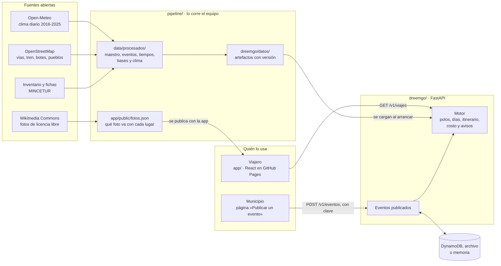

# Informe del prototipo · Semana 10

**DreemGO — Inteligencia de rutas en Perú**
DS3022 · Desarrollo de Producto de Datos · UTEC · Prof. Germain Garcia-Zanabria
Entrega: 14 de octubre de 2026 · Estado del prototipo al 2 de octubre; el de la app, al 6, y el del motor, al 8

## 1 · Qué se puede demostrar hoy

El flujo principal del producto funciona de punta a punta, con datos reales:

1. **El viajero pregunta.** Dice desde cuál de 24 ciudades sale, cuántos días tiene, en qué mes o desde qué fecha viaja y, si quiere, qué le interesa, cuánto piensa gastar y hasta qué altura tolera.
2. **DreemGO propone tres viajes**, cada uno a un polo turístico distinto, para comparar: su costo en una banda, cuánto se tarda en llegar, si el mes conviene y por qué ese polo.
3. **Cada viaje trae su itinerario día por día:** qué visitar, en qué orden y a qué hora se llega, sobre un mapa, con el enlace de cada parada a su ficha oficial de MINCETUR y las fiestas que caen en esas fechas.
4. **El viaje se comparte con un enlace.** No hay cuentas: la misma consulta con los mismos datos da siempre la misma respuesta.
5. **Un municipio publica un evento** con su lugar marcado en un mapa, y el evento sale en el calendario y en las rutas que pasan cerca en esas fechas, con el nombre de quien lo publicó.

La app está publicada en <https://oswaldoaqm.github.io/Alejandros-Team/>. El API todavía no está desplegado: hoy el flujo se demuestra con el API corriendo en una computadora ([`README.md`](./README.md)).

## 2 · Funciones implementadas

### El motor y su API

| Función | Dónde | Qué hace |
|---|---|---|
| Proponer viajes | `GET /v1/viajes` | Hasta tres rutas de polos y bases distintas, con días, paradas, costo, clima del mes, eventos, avisos y motivos |
| Opciones del formulario | `GET /v1/opciones` | Orígenes, intereses con cuántas paradas atiende cada uno, y rangos: la app no los fija |
| Ficha de un polo | `GET /v1/polos/{id}` | Sus paradas por jerarquía, su clima de los doce meses y sus eventos del año |
| Calendario | `GET /v1/eventos` | Fiestas y eventos entre dos fechas, de un polo o de todo el país |
| Publicar un evento | `POST /v1/eventos` | Con clave de publicador. Lo publicado se suma a las rutas cercanas sin cambiar cuáles se proponen |
| Estado | `GET /v1/salud` | Versión del servicio, del contrato y de los datos |

Lo que recibe y devuelve cada uno está en el [contrato](../../docs/CONTRATO.md), versión 1.2, y el esquema OpenAPI sale del código. Los errores llegan en español y con el campo al que se refieren.

### La app

| Pantalla | Qué permite |
|---|---|
| Formulario | Armar la consulta con las opciones que da el API, o pedir una sorpresa |
| Los tres viajes | Comparar tres tarjetas, cada una con su foto, su precio, las horas de ida y el clima del mes, y abrir cualquiera |
| Un viaje | Por qué conviene y qué saber antes de ir; el plan día por día, entero o un día a la vez; un mapa con un pétalo por día y sus lugares numerados; la banda de costo con su desglose; el veredicto del mes con los mejores meses, y las fiestas. Cada lugar abre una hoja con su foto, sus datos y su ficha oficial. Se guarda, se comparte y se imprime |
| La zona de un viaje | Sus lugares, su clima mes a mes y sus fiestas |
| Fiestas | Fiestas y eventos de un mes, por región |
| Guardados | Los viajes guardados en el navegador |
| Publicar un evento | El formulario para municipios, con un mapa para marcar el lugar |
| Cómo funciona | De dónde salen los datos y cómo decide el motor |

Está pensada primero para celular, con tema claro y oscuro. Al abrir baja unos 113 kB; el mapa llega aparte, cuando se abre un viaje. Las fotos son de Wikimedia Commons y cada una lleva su autor y su licencia. En la app, un polo se llama zona, y una ruta, viaje.

### Los datos

| Función | Dónde |
|---|---|
| Lectura de las 6 225 fichas oficiales, con la fuente de cada campo | [`pipeline/fichas.py`](../../pipeline/fichas.py), [`maestro.py`](../../pipeline/maestro.py) |
| Calendario de 758 acontecimientos, con la regla de su fecha | [`pipeline/eventos.py`](../../pipeline/eventos.py) |
| Tiempos de viaje por carretera, tren y bote, sobre OpenStreetMap | [`pipeline/red_vial.py`](../../pipeline/red_vial.py), [`tiempos.py`](../../pipeline/tiempos.py) |
| Dónde se duerme en cada polo, con un polo por cada pueblo donde se duerme | [`pipeline/bases.py`](../../pipeline/bases.py), [`tiempos.py`](../../pipeline/tiempos.py) |
| Clima de cada polo mes a mes y su veredicto | [`pipeline/clima.py`](../../pipeline/clima.py) |
| Una foto de licencia libre para los lugares y los pueblos donde se duerme, cuando la hay | [`pipeline/fotos.py`](../../pipeline/fotos.py) |
| Artefactos versionados que carga el motor | [`pipeline/artefactos.py`](../../pipeline/artefactos.py) |

## 3 · Arquitectura

| Pieza | Tecnología | Dónde corre |
|---|---|---|
| Pipeline | Python, pandas, scipy, osmium | En la computadora de un integrante, cuando cambia una fuente |
| Motor y API | Python, numpy, pydantic, FastAPI | Una imagen de contenedor: en AWS Lambda detrás de una HTTP API, en Render o en local |
| Eventos publicados | DynamoDB en AWS; un archivo o la memoria fuera de AWS | Junto al API |
| App | React, Vite, TypeScript, MapLibre GL | GitHub Pages |
| Integración continua | GitHub Actions | En cada pull request: lint, pruebas, imágenes y la app contra el API |

Tres decisiones explican la forma del sistema:

- **El motor responde desde memoria.** Los datos del motor no cambian cuando alguien usa la app, sino cuando el equipo recalcula el modelo. Por eso son archivos con versión que el motor carga al arrancar, y no una base de datos ([decisión 0003](../../docs/decisiones/0003-artefactos-precalculados.md)). Pesan 1,7 MB.
- **No hay cuentas.** La consulta viaja en la URL y el motor es determinista, así que el enlace es el viaje guardado ([decisión 0001](../../docs/decisiones/0001-sin-login-y-enlace-compartible.md)).
- **Una sola imagen.** El mismo contenedor corre en Lambda, en un host gratuito y en una laptop ([decisión 0002](../../docs/decisiones/0002-stack-y-despliegue.md)).

Cómo cambió cada pieza frente al diseño de la Delivery 1, y por qué, está en el [contrato §5](../../docs/CONTRATO.md).

## 4 · Datos y artefactos

| Qué | Cuánto | Dónde |
|---|---|---|
| Recursos del inventario, con su ficha leída | 6 225 | [`data/procesados/maestro_v3.csv`](../../data/procesados/) |
| Recursos dentro de un polo | 6 047, en 194 polos | [`dreemgo/datos/recursos.json.gz`](../../dreemgo/datos/) |
| Recursos que pueden ser parada de un itinerario | 4 465 | El resto son fiestas, expresiones de folclore y cumbres |
| Polos | 194, uno por cada pueblo donde se duerme. Salen de los 222 grupos del agrupamiento: los 50 que compartían pueblo se juntaron en 22 | [`data/procesados/polos_bases.csv`](../../data/procesados/) |
| Ciudades de origen | 24 | [`pipeline/referencia/origenes.csv`](../../pipeline/referencia/origenes.csv) |
| Acontecimientos con fecha | 739 de 758: 518 con el día que publica la ficha y 221 calculados | [`data/procesados/eventos_v3.csv`](../../data/procesados/) |
| Polos con su propio clima diario | 35 de 194; los demás usan el clima de su región | [`data/procesados/clima_polo_mes.csv`](../../data/procesados/) |
| Paradas con foto | 479 de 4 465, y 77 de los 161 imperdibles. En 120 de los 194 polos hay al menos una | [`app/public/fotos.json`](../../app/public/) |

La versión de los datos es `2026.10.3`. Cada tabla de `data/procesados/` tiene su diccionario, y el manifiesto de los artefactos guarda la fecha de cada fuente y la huella de cada archivo. Todas las fuentes son abiertas y su licencia permite redistribuirlas ([`DATA_LICENSES.md`](../../DATA_LICENSES.md)).

## 5 · El componente analítico

El motor no usa modelos supervisados: no hay clics ni valoraciones de los que aprender ([decisión 0004](../../docs/decisiones/0004-sin-modelos-supervisados.md)). Combina cuatro métodos, y cada uno tiene una medida de qué tan bien funciona.

| Método | Qué hace | Qué se midió |
|---|---|---|
| **Agrupamiento** (TA-01) | Junta los recursos en 222 grupos por enlace completo sobre una distancia de viaje, con el diámetro acotado. Los grupos que duermen en el mismo pueblo son después un solo polo: quedan 194 | Ningún grupo pasa de 80 km de viaje efectivo. La alternativa, HDBSCAN, daba grupos de hasta 21 horas de punta a punta |
| **Tiempos de viaje** | Camino más rápido sobre una red de 1,45 millones de vértices, con el tren a Machu Picchu y los botes | Calibrada con 1 780 recorridos de las fichas: 22 % de error medio y 17 % de mediano, por validación cruzada. La fórmula anterior erraba en 48 % |
| **Estacionalidad** (TA-05) | Una regla de dos ejes sobre diez años de lluvia: el mes se desaconseja, lleva advertencia o conviene | Regla declarada, no predicción. Las horas de sol no se publican: el reanálisis no ve la neblina de la costa |
| **Itinerario** (TA-04) | Elige qué visitar y en qué orden para sumar el mayor valor en jornadas de 8 horas: inserción voraz, 2-opt y tres arranques | Diez propiedades verificadas sobre 1 000 consultas al azar (sección 7). La brecha contra el óptimo exacto se mide en la semana 12 |

Encima va el **puntaje** que ordena los polos: 70 % la calidad del itinerario, corregida por la temporada y el presupuesto, y 30 % la novedad, que premia a los polos fuera del circuito de Lima y Cusco y a los más lejanos. La calidad es el valor de lo que se visita: una parada vale 1, 2, 6 o 24 según su jerarquía, para que un lugar imperdible pese más que un día lleno de lugares corrientes. Y no se propone un viaje que pasaría más días en el camino que de visita. El **costo** es una banda y no un precio: va del percentil 20 al 80 de 4 000 simulaciones sobre el rango de cada precio, con su desglose en transporte, alojamiento, comida y entradas. El ancho de la banda dice cuánto no se sabe.

Las fechas de los acontecimientos se midieron contra 40 anotados a mano: 38 de 39 caen en días de fiesta ([`pipeline/README.md`](../../pipeline/README.md)).

## 6 · Lo que el motor propone hoy

Para saber qué recomienda el prototipo, se recorrió una rejilla de 1 152 consultas: las 24 ciudades de origen, viajes de 2, 4, 6 y 9 días y los doce meses, sin intereses ni presupuesto ([`code/cobertura.py`](./code/cobertura.py)). La primera medición, con los datos `2026.10.2`, mostró que el motor no proponía nunca Machu Picchu ni Huaraz. Se midió por qué y, del 7 al 8 de octubre, se cambiaron cuatro cosas: un polo por cada pueblo donde se duerme, una parada imperdible vale más, un día de solo viaje puede durar 9 horas, y ningún viaje pasa más días en el camino que allá ([decisiones 0013, 0014 y 0015](../../docs/decisiones/README.md)).

| Medida | Antes | Ahora |
|---|---|---|
| Consultas con tres rutas | 1 104 de 1 152 | 1 092. Las otras 60 dan dos: salen de Iquitos o de Puerto Maldonado, que casi no tienen carretera |
| Rutas que duermen en Machupicchu Pueblo | 0 | 9, todas desde el Cusco |
| Rutas que duermen en Huaraz | 0 | 70, desde siete ciudades, Lima entre ellas |
| Rutas fuera del circuito de Lima y Cusco | 84 % | 77 % |
| Polos que aparecen al menos una vez | 83 de 222 | 72 de 194 |
| Polos distintos que ve un mismo origen | 11 de mediana, entre 4 y 18 | 10 de mediana, entre 2 y 15 |
| Rutas que se llevan los diez polos más propuestos | 50 % | 57 % |
| Rutas con el aviso de que la ida y la vuelta se llevan buena parte del viaje | 27 % | 36 % |
| Tiempo de respuesta, en la misma computadora de dos núcleos | 0,26 s de mediana y 1,0 s como máximo | 0,25 s de mediana y 1,0 s como máximo |

El cambio tiene un precio, y está en la misma tabla: el motor reparte un poco menos. Hay menos rutas fuera del circuito, los diez polos más propuestos se llevan más rutas y más viajes llevan el aviso de que se pasa mucho tiempo en el camino. Desde Iquitos, con nueve días, quedan dos opciones: la tercera era de ocho días de río para uno de visita. Si el balance es bueno no lo dice la rejilla; se mide en la semana 12, con consultas anotadas por el equipo.

## 7 · Cómo se prueba

- **672 pruebas del motor, el API y el pipeline**, y **175 de la app**, en cada pull request.
- **Diez propiedades del contrato** sobre consultas generadas al azar: ninguna parada pasa la altitud pedida, los días suman lo pedido, ninguna jornada con visitas pasa de 8 horas ni un día de solo viaje de 9, toda parada enlaza a su ficha, un mes desaconsejado nunca sale sin aviso, el presupuesto ordena pero no esconde, y la misma consulta da la misma respuesta. Al cerrar cada etapa se corren con 1 000 consultas.
- **28 pruebas de humo en un navegador**, en tamaño de celular y de escritorio, contra el API de verdad: planear un viaje, abrir el mapa, compartir, guardar y publicar un evento. Revisan también que ninguna pantalla se desborde y pasan un analizador de accesibilidad.
- **Las imágenes del API** se construyen y se arrancan en cada pull request.
- **El despliegue se ensayó** contra un simulador de AWS antes de tener cuenta: la configuración, la tabla y el API contra ella.

## 8 · Límites conocidos

**Del motor**

- **Machu Picchu solo sale desde el Cusco.** Desde Lima queda a 24 horas y media por tierra. Para proponerlo desde las demás ciudades hacen falta vuelos y viajes de varios polos, los dos límites que siguen.
- **El valor de una parada es un supuesto.** La escala 1, 2, 6, 24 hace que salgan los destinos más conocidos, pero no está calibrada con viajes reales y concentra las propuestas (sección 6).
- **No hay vuelos.** Se viaja por carretera, tren y bote. De Lima al Cusco son 22 horas y media de carretera, así que en una semana el motor no lo propone; y a Iquitos, que no tiene carretera, solo se llega en días de río.
- **Un viaje recorre un solo polo.** No combina polos vecinos, como el Valle Sagrado y Machu Picchu.
- **No se puede pedir un destino.** El motor propone; el viajero no puede decir «quiero ir a Huaraz», que es uno de los casos de uso de la semana 5.
- **El itinerario es una heurística.** Todavía no se sabe a qué distancia queda del óptimo.
- **La jornada no reserva tiempo para almorzar**, y los traslados largos no consideran buses nocturnos.

**De los datos**

- **Clima:** solo 35 de los 194 polos tienen su propio clima diario. Los otros 159 usan el de su región, y la respuesta lo avisa. La descarga de los demás grupos sigue en curso.
- **Tiempos de viaje:** el error medio es de 22 %. En tramos de menos de 10 km llega a 31 %, que son 4 minutos de mediana.
- **Costos:** los parámetros de alojamiento, comida y transporte vienen de fuentes publicadas, pero no están calibrados con viajes reales. Por eso el costo se da como banda.
- **Acontecimientos:** 19 no tienen fecha, y no se leen las fechas lunares ni las relativas a otra fiesta.
- **Datos personales:** el filtro reconoce a una persona por reglas: sus mayúsculas junto a un teléfono, su tratamiento o su cargo. Un nombre sin nada de eso, en un texto sin teléfono, se queda.
- **Lo que queda fuera de la red:** Madre de Dios no tiene rutas de bote en OpenStreetMap, y 178 recursos no pertenecen a ningún polo.

**Del servicio y de la app**

- **El API no está desplegado**, y su arranque en frío en Lambda no se ha medido. En local arranca en un segundo y usa unos 100 MB.
- **Publicar eventos** usa una sola clave compartida, sin moderación. Un evento se retira a mano, y su descripción se guarda pero no se muestra.
- **«Guardados»** vive en el navegador: no pasa de un dispositivo a otro.
- **Fotos:** solo una de cada nueve paradas tiene foto, y menos de la mitad de los imperdibles. Se eligen por cercanía y por nombre, y las 679 propuestas se revisaron a ojo, en miniatura: se quitaron 112. Un error de la fuente que no se vea en la miniatura se queda.
- **La app** imprime sin el mapa, y le pide el fondo del mapa y las fotos a servicios externos: sin ellos sigue, con un mapa liso y sin fotos.
- **No se ha probado con usuarios.** La prueba de usabilidad es de la semana 12.

## 9 · Retos técnicos

| Reto | Cómo se resolvió |
|---|---|
| El inventario trae la latitud y la longitud intercambiadas: con sus etiquetas, ningún recurso cae en el Perú | Se corrige al leer y cada coordenada queda marcada con lo que se le hizo |
| La jerarquía del dataset solo coincide con la ficha oficial en el 59,7 % de los recursos | Se bajan y se leen las 6 225 fichas, y cada campo dice de dónde salió |
| Las fichas escriben las distancias y los tiempos a mano («74 km/ 1 hora con 5 min») | Un lector propio entiende el 98,9 % de las celdas; lo dudoso queda marcado y lo ilegible viaja vacío |
| La distancia en línea recta no dice cuánto se tarda: la fórmula inicial erraba en 48 % | Una red propia sobre OpenStreetMap, calibrada con los recorridos que publican las fichas |
| A Machu Picchu se llega en tren, y a las islas, en bote | El tren y los botes entraron a la red: los pares de origen y base sin camino bajaron de 427 a 24 |
| Las fichas publican el teléfono y el nombre de quien atiende cada lugar | Un filtro los reemplaza al leer la ficha y se revisó a mano sobre las 6 225: ninguno llega al repositorio ni a los artefactos |
| El centro de un polo no es un lugar donde dormir | Cada polo duerme en un pueblo real, elegido por lo cerca que deja las paradas y por su hospedaje |
| Huaraz era la base de cuatro grupos del agrupamiento, que competían entre sí, y el motor no proponía ninguno | Los grupos que duermen en el mismo pueblo son un solo polo, con los tiempos entre sus paradas calculados sobre la red: ninguno de los que ya había cambió |
| El clima de la capital regional no es el del polo: Pozuzo, a 748 m, recibía el de Cerro de Pasco, a más de 4 000 | Un punto de clima por grupo del agrupamiento. La cuota gratuita de la fuente da para 36 por día |
| Lo que publica un municipio cambia los datos, y la misma consulta tiene que dar la misma respuesta | La versión de los datos lleva la huella de lo publicado, y lo publicado no entra al puntaje |
| En la nube hay varios servidores a la vez, y quien publica tiene que ver su evento | Cada servidor pregunta cada dos segundos si otro publicó algo |
| Desplegar sin presupuesto y sin cuenta | Una sola imagen para Lambda y para un host gratuito, y un ensayo contra un simulador que encontró dos errores en la guía |
| Que abra en un celular con datos móviles | 113 kB al abrir, y el mapa aparte |
| Mostrar los lugares sin fotos propias ni presupuesto para comprarlas | Wikidata dice qué foto de Wikimedia Commons corresponde a cada lugar. Solo entran las de licencia libre, con su autor a la vista, y cada una se revisó a ojo |

## 10 · Lo que falta

**Antes del 14 de octubre**

- Desplegar el API y darle su dirección a la app publicada.
- Rehacer los artefactos con el clima de los 222 grupos.
- Medir el arranque en frío y probar la app en un celular con datos móviles.
- La presentación y las capturas de esta entrega.

**Para la semana 12**

- Calibrar el valor de una parada, que hoy es un supuesto, con las consultas anotadas por el equipo.
- Viajes de varios polos y poder pedir un destino.
- La evaluación: la brecha contra el óptimo exacto, consultas anotadas por el equipo con su acuerdo medido, una prueba de usabilidad con cinco personas y tres casos de estudio.

**Para la entrega final**

- El informe final, el video, la página del proyecto, y el Canvas y los requisitos finales.
