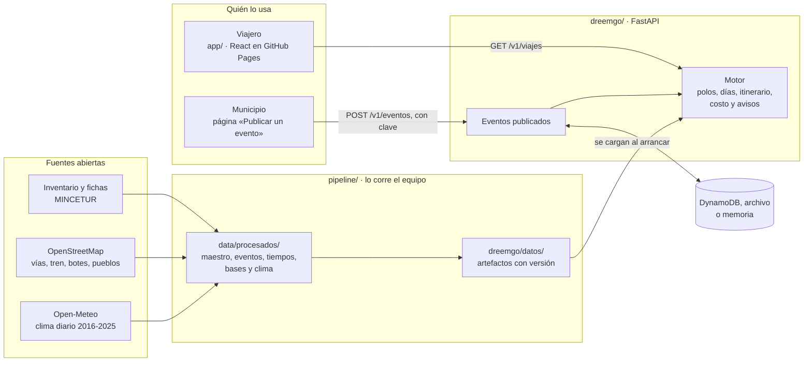

# Informe del prototipo · Semana 10

**DreemGO — Inteligencia de rutas en Perú**
DS3022 · Desarrollo de Producto de Datos · UTEC · Prof. Germain Garcia-Zanabria
Entrega: 14 de octubre de 2026 · Estado del prototipo al 2 de octubre

## 1 · Qué se puede demostrar hoy

El flujo principal del producto funciona de punta a punta, con datos reales:

1. **El viajero pregunta.** Dice desde cuál de 24 ciudades sale, cuántos días tiene, en qué mes o desde qué fecha viaja y, si quiere, qué le interesa, cuánto piensa gastar y hasta qué altura tolera.
2. **DreemGO propone tres viajes**, cada uno a un polo turístico distinto, para comparar: su costo en una banda, cuánto se tarda en llegar, si el mes conviene y por qué ese polo.
3. **Cada viaje trae su itinerario día por día:** qué visitar, en qué orden y a qué hora se llega, sobre un mapa, con el enlace de cada parada a su ficha oficial de MINCETUR y las fiestas que caen en esas fechas.
4. **El viaje se comparte con un enlace.** No hay cuentas: la misma consulta con los mismos datos da siempre la misma respuesta.
5. **Un municipio publica un evento** con su lugar marcado en un mapa, y el evento sale en el calendario y en las rutas que pasan cerca en esas fechas, con el nombre de quien lo publicó.

La app está publicada en <https://oswaldoaqm.github.io/Alejandros-Team/>. El API todavía no está desplegado: hoy el flujo se demuestra con el API corriendo en una computadora ([`README.md`](./README.md)).

## 2 · Funciones implementadas

### El motor y su API

| Función | Dónde | Qué hace |
|---|---|---|
| Proponer viajes | `GET /v1/viajes` | Hasta tres rutas de polos y bases distintas, con días, paradas, costo, clima del mes, eventos, avisos y motivos |
| Opciones del formulario | `GET /v1/opciones` | Orígenes, intereses con cuántas paradas atiende cada uno, y rangos: la app no los fija |
| Ficha de un polo | `GET /v1/polos/{id}` | Sus paradas por jerarquía, su clima de los doce meses y sus eventos del año |
| Calendario | `GET /v1/eventos` | Fiestas y eventos entre dos fechas, de un polo o de todo el país |
| Publicar un evento | `POST /v1/eventos` | Con clave de publicador. Lo publicado se suma a las rutas cercanas sin cambiar cuáles se proponen |
| Estado | `GET /v1/salud` | Versión del servicio, del contrato y de los datos |

Lo que recibe y devuelve cada uno está en el [contrato](../../docs/CONTRATO.md), versión 1.2, y el esquema OpenAPI sale del código. Los errores llegan en español y con el campo al que se refieren.

### La app

| Pantalla | Qué permite |
|---|---|
| Formulario | Armar la consulta con las opciones que da el API, o pedir una sorpresa |
| Rutas | Comparar tres tarjetas y abrir cualquiera |
| Detalle de una ruta | Itinerario día por día, mapa con las paradas numeradas, banda de costo con su desglose, veredicto del mes con los mejores meses, eventos, avisos y motivos |
| Ficha de un polo | Clima mes a mes, lugares y fiestas |
| Calendario | Fiestas y eventos de un mes, por región |
| Mis viajes | Los viajes guardados en el navegador |
| Publicar un evento | El formulario para municipios, con un mapa para marcar el lugar |
| Cómo funciona | De dónde salen los datos y cómo decide el motor |

Está pensada primero para celular. Al abrir baja unos 99 kB; el mapa llega aparte, cuando se abre una ruta.

### Los datos

| Función | Dónde |
|---|---|
| Lectura de las 6 225 fichas oficiales, con la fuente de cada campo | [`pipeline/fichas.py`](../../pipeline/fichas.py), [`maestro.py`](../../pipeline/maestro.py) |
| Calendario de 758 acontecimientos, con la regla de su fecha | [`pipeline/eventos.py`](../../pipeline/eventos.py) |
| Tiempos de viaje por carretera, tren y bote, sobre OpenStreetMap | [`pipeline/red_vial.py`](../../pipeline/red_vial.py), [`tiempos.py`](../../pipeline/tiempos.py) |
| Dónde se duerme en cada polo | [`pipeline/bases.py`](../../pipeline/bases.py) |
| Clima de cada polo mes a mes y su veredicto | [`pipeline/clima.py`](../../pipeline/clima.py) |
| Artefactos versionados que carga el motor | [`pipeline/artefactos.py`](../../pipeline/artefactos.py) |

## 3 · Arquitectura

| Pieza | Tecnología | Dónde corre |
|---|---|---|
| Pipeline | Python, pandas, scipy, osmium | En la computadora de un integrante, cuando cambia una fuente |
| Motor y API | Python, numpy, pydantic, FastAPI | Una imagen de contenedor: en AWS Lambda detrás de una HTTP API, en un Space de Hugging Face o en local |
| Eventos publicados | DynamoDB en AWS; un archivo o la memoria fuera de AWS | Junto al API |
| App | React, Vite, TypeScript, MapLibre GL | GitHub Pages |
| Integración continua | GitHub Actions | En cada pull request: lint, pruebas, imágenes y la app contra el API |

Tres decisiones explican la forma del sistema:

- **El motor responde desde memoria.** Los datos del motor no cambian cuando alguien usa la app, sino cuando el equipo recalcula el modelo. Por eso son archivos con versión que el motor carga al arrancar, y no una base de datos ([decisión 0003](../../docs/decisiones/0003-artefactos-precalculados.md)). Pesan 1,7 MB.
- **No hay cuentas.** La consulta viaja en la URL y el motor es determinista, así que el enlace es el viaje guardado ([decisión 0001](../../docs/decisiones/0001-sin-login-y-enlace-compartible.md)).
- **Una sola imagen.** El mismo contenedor corre en Lambda, en un host gratuito y en una laptop ([decisión 0002](../../docs/decisiones/0002-stack-y-despliegue.md)).

Cómo cambió cada pieza frente al diseño de la Delivery 1, y por qué, está en el [contrato §5](../../docs/CONTRATO.md).

## 4 · Datos y artefactos

| Qué | Cuánto | Dónde |
|---|---|---|
| Recursos del inventario, con su ficha leída | 6 225 | [`data/procesados/maestro_v3.csv`](../../data/procesados/) |
| Recursos dentro de un polo | 6 047, en 222 polos | [`dreemgo/datos/recursos.json.gz`](../../dreemgo/datos/) |
| Recursos que pueden ser parada de un itinerario | 4 465 | El resto son fiestas, expresiones de folclore y cumbres |
| Pueblos donde se duerme | 194: 22 sirven a más de un polo | [`data/procesados/polos_bases.csv`](../../data/procesados/) |
| Ciudades de origen | 24 | [`pipeline/referencia/origenes.csv`](../../pipeline/referencia/origenes.csv) |
| Acontecimientos con fecha | 739 de 758: 518 con el día que publica la ficha y 221 calculados | [`data/procesados/eventos_v3.csv`](../../data/procesados/) |
| Polos con su propio clima diario | 36 de 222; los demás usan el clima de su región | [`data/procesados/clima_polo_mes.csv`](../../data/procesados/) |

La versión de los datos es `2026.10.2`. Cada tabla de `data/procesados/` tiene su diccionario, y el manifiesto de los artefactos guarda la fecha de cada fuente y la huella de cada archivo. Todas las fuentes son abiertas y su licencia permite redistribuirlas ([`DATA_LICENSES.md`](../../DATA_LICENSES.md)).

## 5 · El componente analítico

El motor no usa modelos supervisados: no hay clics ni valoraciones de los que aprender ([decisión 0004](../../docs/decisiones/0004-sin-modelos-supervisados.md)). Combina cuatro métodos, y cada uno tiene una medida de qué tan bien funciona.

| Método | Qué hace | Qué se midió |
|---|---|---|
| **Agrupamiento** (TA-01) | Junta los recursos en polos por enlace completo sobre una distancia de viaje, con el diámetro acotado | Ningún polo pasa de 80 km de viaje efectivo. La alternativa, HDBSCAN, daba polos de hasta 21 horas de punta a punta |
| **Tiempos de viaje** | Camino más rápido sobre una red de 1,45 millones de vértices, con el tren a Machu Picchu y los botes | Calibrada con 1 780 recorridos de las fichas: 22 % de error medio y 17 % de mediano, por validación cruzada. La fórmula anterior erraba en 48 % |
| **Estacionalidad** (TA-05) | Una regla de dos ejes sobre diez años de lluvia: el mes se desaconseja, lleva advertencia o conviene | Regla declarada, no predicción. Las horas de sol no se publican: el reanálisis no ve la neblina de la costa |
| **Itinerario** (TA-04) | Elige qué visitar y en qué orden para sumar el mayor valor en jornadas de 8 horas: inserción voraz, 2-opt y tres arranques | Diez propiedades verificadas sobre 1 000 consultas al azar (sección 7). La brecha contra el óptimo exacto se mide en la semana 12 |

Encima va el **puntaje** que ordena los polos: 70 % la calidad del itinerario, corregida por la temporada y el presupuesto, y 30 % la novedad, que premia a los polos fuera del circuito de Lima y Cusco y a los más lejanos. El **costo** es una banda y no un precio: va del percentil 20 al 80 de 4 000 simulaciones sobre el rango de cada precio, con su desglose en transporte, alojamiento, comida y entradas. El ancho de la banda dice cuánto no se sabe.

Las fechas de los acontecimientos se midieron contra 40 anotados a mano: 38 de 39 caen en días de fiesta ([`pipeline/README.md`](../../pipeline/README.md)).

## 6 · Lo que el motor propone hoy

Para saber qué recomienda el prototipo, se recorrió una rejilla de 1 152 consultas: las 24 ciudades de origen, viajes de 2, 4, 6 y 9 días y los doce meses, sin intereses ni presupuesto ([`code/cobertura.py`](./code/cobertura.py)).

| Medida | Resultado |
|---|---|
| Consultas con tres rutas | 1 104 de 1 152. Las otras 48 dan dos: salen de Iquitos o de Puerto Maldonado, que casi no tienen carretera |
| Rutas fuera del circuito de Lima y Cusco | 84 % |
| Polos que aparecen al menos una vez | 83 de 222 |
| Polos distintos que ve un mismo origen | 11 de mediana, entre 4 y 18 |
| Tiempo de respuesta | 0,3 s de mediana y 1,1 s como máximo, en una computadora de dos núcleos |

Dos cosas de esa tabla son límites del prototipo, y están en la sección siguiente: el motor reparte la demanda, que es lo que busca el producto, pero deja sin proponer a 139 polos, y entre ellos están Machu Picchu y los cuatro polos que duermen en Huaraz.

## 7 · Cómo se prueba

- **605 pruebas del motor, el API y el pipeline**, y **127 de la app**, en cada pull request.
- **Diez propiedades del contrato** sobre consultas generadas al azar: ninguna parada pasa la altitud pedida, los días suman lo pedido, ninguna jornada pasa de 8 horas, toda parada enlaza a su ficha, un mes desaconsejado nunca sale sin aviso, el presupuesto ordena pero no esconde, y la misma consulta da la misma respuesta. Al cerrar cada etapa se corren con 1 000 consultas.
- **26 pruebas de humo en un navegador**, en tamaño de celular y de escritorio, contra el API de verdad: planear un viaje, abrir el mapa, compartir, guardar y publicar un evento. Revisan también que ninguna pantalla se desborde y pasan un analizador de accesibilidad.
- **Las imágenes del API** se construyen y se arrancan en cada pull request.
- **El despliegue se ensayó** contra un simulador de AWS antes de tener cuenta: la configuración, la tabla y el API contra ella.

## 8 · Límites conocidos

**Del motor**

- **No propone los destinos más conocidos.** En las 1 152 consultas de la rejilla, ninguna ruta duerme en Machupicchu Pueblo ni en Huaraz. Hay tres causas. El valor de un itinerario suma paradas, y un sitio de jerarquía 4 vale lo mismo que cuatro de jerarquía 2. La novedad, que es el 30 % del puntaje, casi no suma en los polos del circuito. Y los alrededores de Huaraz están repartidos en cuatro polos que compiten entre sí.
- **No hay vuelos.** Se viaja por carretera, tren y bote. De Lima al Cusco son 22 horas y media de carretera, así que en una semana el motor no lo propone; y a Iquitos, que no tiene carretera, solo se llega en días de río.
- **Un viaje recorre un solo polo.** No combina polos vecinos, como el Valle Sagrado y Machu Picchu.
- **No se puede pedir un destino.** El motor propone; el viajero no puede decir «quiero ir a Huaraz», que es uno de los casos de uso de la semana 5.
- **El itinerario es una heurística.** Todavía no se sabe a qué distancia queda del óptimo.
- **La jornada no reserva tiempo para almorzar**, y los traslados largos no consideran buses nocturnos.

**De los datos**

- **Clima:** solo 36 de los 222 polos tienen su propio clima diario. Los otros 186 usan el de su región, y la respuesta lo avisa. La descarga de los que faltan termina hacia el 6 de octubre.
- **Tiempos de viaje:** el error medio es de 22 %. En tramos de menos de 10 km llega a 31 %, que son 4 minutos de mediana.
- **Costos:** los parámetros de alojamiento, comida y transporte vienen de fuentes publicadas, pero no están calibrados con viajes reales. Por eso el costo se da como banda.
- **Acontecimientos:** 19 no tienen fecha, y no se leen las fechas lunares ni las relativas a otra fiesta.
- **Datos personales:** el filtro reconoce a una persona por reglas: sus mayúsculas junto a un teléfono, su tratamiento o su cargo. Un nombre sin nada de eso, en un texto sin teléfono, se queda.
- **Lo que queda fuera de la red:** Madre de Dios no tiene rutas de bote en OpenStreetMap, y 178 recursos no pertenecen a ningún polo.

**Del servicio y de la app**

- **El API no está desplegado**, y su arranque en frío en Lambda no se ha medido. En local arranca en un segundo y usa unos 100 MB.
- **Publicar eventos** usa una sola clave compartida, sin moderación. Un evento se retira a mano, y su descripción se guarda pero no se muestra.
- **«Mis viajes»** vive en el navegador: no pasa de un dispositivo a otro.
- **La app** no tiene modo oscuro, imprime sin el mapa y depende de un servicio externo para el fondo del mapa.
- **No se ha probado con usuarios.** La prueba de usabilidad es de la semana 12.

## 9 · Retos técnicos

| Reto | Cómo se resolvió |
|---|---|
| El inventario trae la latitud y la longitud intercambiadas: con sus etiquetas, ningún recurso cae en el Perú | Se corrige al leer y cada coordenada queda marcada con lo que se le hizo |
| La jerarquía del dataset solo coincide con la ficha oficial en el 59,7 % de los recursos | Se bajan y se leen las 6 225 fichas, y cada campo dice de dónde salió |
| Las fichas escriben las distancias y los tiempos a mano («74 km/ 1 hora con 5 min») | Un lector propio entiende el 98,9 % de las celdas; lo dudoso queda marcado y lo ilegible viaja vacío |
| La distancia en línea recta no dice cuánto se tarda: la fórmula inicial erraba en 48 % | Una red propia sobre OpenStreetMap, calibrada con los recorridos que publican las fichas |
| A Machu Picchu se llega en tren, y a las islas, en bote | El tren y los botes entraron a la red: los pares de origen y base sin camino bajaron de 427 a 24 |
| Las fichas publican el teléfono y el nombre de quien atiende cada lugar | Un filtro los reemplaza al leer la ficha y se revisó a mano sobre las 6 225: ninguno llega al repositorio ni a los artefactos |
| El centro de un polo no es un lugar donde dormir | Cada polo duerme en un pueblo real, elegido por lo cerca que deja las paradas y por su hospedaje |
| El clima de la capital regional no es el del polo: Pozuzo, a 748 m, recibía el de Cerro de Pasco, a más de 4 000 | Un punto de clima por polo. La cuota gratuita de la fuente da para 36 polos por día |
| Lo que publica un municipio cambia los datos, y la misma consulta tiene que dar la misma respuesta | La versión de los datos lleva la huella de lo publicado, y lo publicado no entra al puntaje |
| En la nube hay varios servidores a la vez, y quien publica tiene que ver su evento | Cada servidor pregunta cada dos segundos si otro publicó algo |
| Desplegar sin presupuesto y sin cuenta | Una sola imagen para Lambda y para un host gratuito, y un ensayo contra un simulador que encontró dos errores en la guía |
| Que abra en un celular con datos móviles | 99 kB al abrir, y el mapa aparte |

## 10 · Lo que falta

**Antes del 14 de octubre**

- Desplegar el API y darle su dirección a la app publicada.
- Rehacer los artefactos con el clima de los 222 polos.
- Medir el arranque en frío y probar la app en un celular con datos móviles.
- La presentación y las capturas de esta entrega.

**Para la semana 12**

- Que el motor proponga también los destinos más conocidos: revisar cómo vale una parada y cuánto pesa la novedad, y medir cuánto cambian las rutas.
- Viajes de varios polos y poder pedir un destino.
- La evaluación: la brecha contra el óptimo exacto, consultas anotadas por el equipo con su acuerdo medido, una prueba de usabilidad con cinco personas y tres casos de estudio.

**Para la entrega final**

- El informe final, el video, la página del proyecto, y el Canvas y los requisitos finales.
